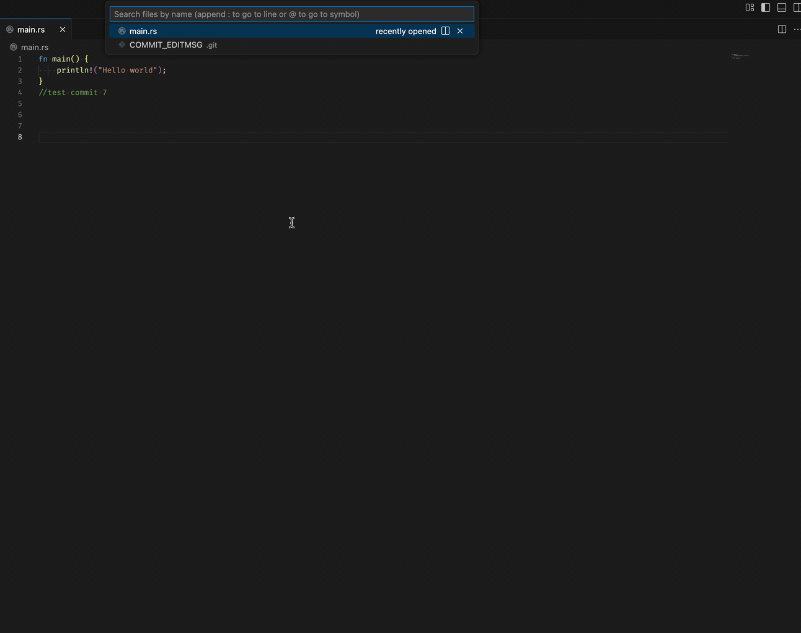

# Squash-Push VS Code Extension


A VS Code extension that simplifies Git workflow by helping developers squash multiple commits before pushing to a remote repository.

## Features

- 🔍 Automatically identifies your current Git branch
- 🔄 Detects upstream branch configuration
- 📋 Lists local commits that haven't been pushed yet
- ✅ Interactive UI to select base commit for squashing operations
- 🔄 Performs squash operation with a single command



## Installation

1. Launch VS Code
2. Go to Extensions view (Ctrl+Shift+X / Cmd+Shift+X)
3. Search for "Squash-Push"
4. Click Install

## Usage

1. Open a Git repository in VS Code
2. Open the Command Palette (Ctrl+Shift+P / Cmd+Shift+P)
3. Type "Squash Local Commits" OR "Squash-Push: Squash Local Commits" and select the command
4. Select the oldest commit you want to keep as the base for squashing
5. The extension will squash your commits and open the commit message editor
6. Save your new commit message and push your changes

## Requirements

- Git must be installed and available in your PATH
- VS Code 1.60 or higher

## Extension Settings

This extension doesn't add any VS Code settings yet. Future versions may include:

- Custom commit message templates
- Auto-push option after squashing
- Branch protection settings

## Known Issues

- Cannot squash onto the root commit (first commit in repository)
- May encounter issues with merge commits

## Development

### Setup

```bash
# Clone the repository
git clone https://github.com/yourusername/squash-push.git

# Navigate to the project directory
cd squash-push

# Install dependencies
npm install

# Open in VS Code
code .
```

### Build and Run

- Press F5 to start debugging
- Run `npm run compile` to compile the TypeScript code
- Run `npm run watch` to watch for file changes during development

### Testing

```bash
npm test
```

## Technical Documentation

### Core Functions

The extension provides several utility functions for Git operations:

- `execGitCommand`: Executes Git commands and returns results as promises
- `getCurrentBranch`: Gets the name of the current Git branch
- `getCurrentUpStreamBranch`: Determines the upstream branch for the current branch
- `getLocalCommits`: Retrieves a list of local commits
- `hasParent`: Checks if a commit has a parent commit
- `showCommitSelections`: Displays UI for selecting commits
- `getCommitID`: Extracts and validates the selected commit ID

For detailed API documentation, see [DOCUMENTATION.md](DOCUMENTATION.md).

## Error Handling

The extension handles several error conditions:
- No workspace folder found
- Detached HEAD state
- No local commits found
- Multiple commits selected as base (only one is allowed)
- Attempting to squash onto a root commit
- Errors during the squash operation

## Contributing

Contributions are welcome! Please feel free to submit a Pull Request.

1. Fork the repository
2. Create your feature branch (`git checkout -b feature/amazing-feature`)
3. Commit your changes (`git commit -m 'Add some amazing feature'`)
4. Push to the branch (`git push origin feature/amazing-feature`)
5. Open a Pull Request

## Future Enhancements

- Support for multiple workspace folders
- Interactive rebase option
- Custom commit message templates
- Automatic push after squash
- Branch protection rules
- Undo squash operation

## License

This project is licensed under the MIT License - see the [LICENSE](LICENSE) file for details.

## Acknowledgments

- VS Code Extension API documentation
- Git documentation